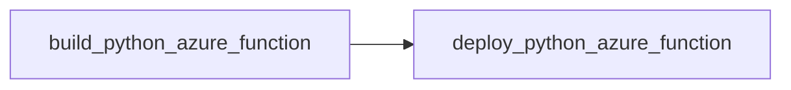

# Base Workflows

Base reusable workflows for [Github Actions](https://docs.github.com/en/actions/using-workflows/reusing-workflows).

## List of worfklows

### Python

#### Build Python Tests

- `build_python_tests.yml`: runs Python unit tests, linters code.

### Terraform
### Build & Deploy Terraform deployment

- `build_deploy_terraform.yml`: workflow for terraform deployments (build + deploy).

### Azure Functions
#### Build Python Azure Function

- `build_python_azure_function.yml`: builds an Azure Python Function, executes unit tests and uploads the `.zip` artifact.

#### Deploy Python Azure Function

- `deploy_python_azure_function.yml`: deploys a previously built Python Function to Azure.

> Note: this workflow depends on `build_python_azure_function.yml` pointing at the built `$ARTIFACT_NAME`.

### Bicep 

#### Validate Bicep

- `validate_bicep.yml`: validates bicep infrastucture file.

#### Deploy Bicep

- `deploy_bicep.yml`: deploys a bicep infrastucture file with a parameter file.